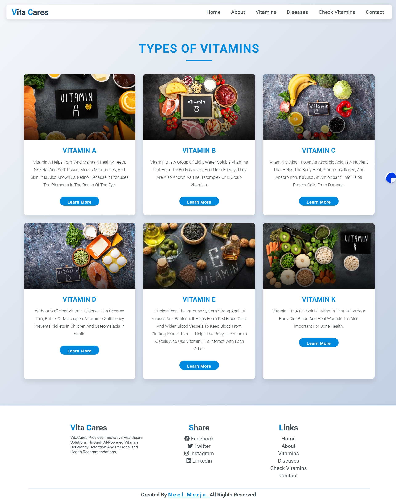

## Project Setup

1. **Clone the Repository**
   ```bash
   git clone <repository-url>
   cd VitaCam-Application-main
   ```

2. **Install Dependencies**
   ```bash
   pip install -r requirements.txt
   ```

3. **Ensure Model File is Present**
   - Place the `1.h5` Keras model file in the project root directory.

4. **Run the Application**
   ```bash
   python app.py
   ```
   - The app will start on [http://localhost:5001](http://localhost:5001)

5. **Navigate the Web App**
   - Home: `/`
   - About: `/about`
   - Vitamin Info: `/vita`
   - Diseases: `/diseases`
   - Prediction: `/predict`
   - Contact: `/contact`
   - Data: `/data`

**Requirements:**
- Python 3.7+
- Flask, TensorFlow, NumPy, Requests (see `requirements.txt`)

**Note:**
- The app is for educational purposes, not for medical diagnosis.

# VitaCam Application

## Project Description
VitaCam is a web application that uses deep learning to detect vitamin deficiencies from uploaded images. The app leverages a trained Keras model to predict which vitamin (A, B, C, D, E, or K) is most likely deficient based on the image provided by the user. The application also includes informational pages about vitamins, diseases, and contact forms.

## Features
- Upload an image and receive a prediction of vitamin deficiency.
- Informational pages about vitamins and related diseases.
- Contact form for user queries.
- Data page to view submitted contact forms (admin feature).


## Project Structure
```
VitaCam-Application-main/
│
├── app.py                  # Main Flask application
├── 1.h5                    # Trained Keras model
├── requirements.txt        # Python dependencies
├── static/                 # Static files (CSS, JS, images)
│   ├── css/
│   ├── images/
│   └── js/
├── templates/              # HTML templates
│   ├── about.html
│   ├── contact.html
│   ├── data.html
│   ├── diseases.html
│   ├── home.html
│   ├── index.html
│   └── vita.html
└── uploaded_image.jpg      # Temporary uploaded image
```

## Screenshots
### Home Page


### Prediction Page


### About Page


### Diseases Page


### Vitamin Page


## Contact

---

**Note:**
- Ensure the model file (`1.h5`) is present in the root directory.
- The app is for educational purposes and not for medical diagnosis.
